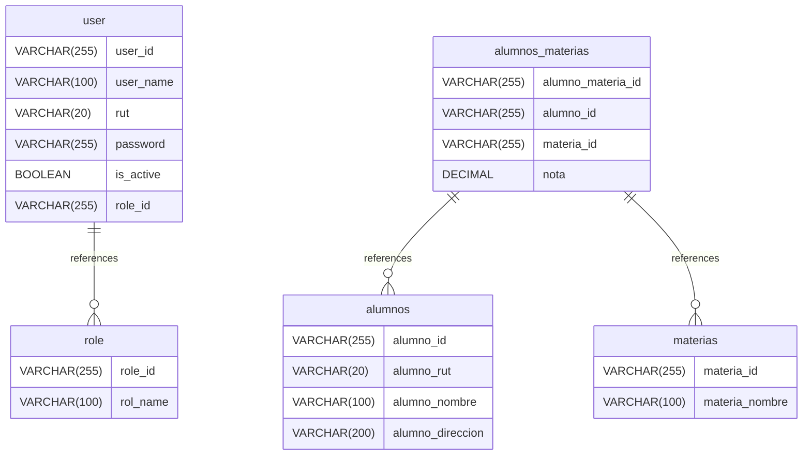

# Untitled Diagram documentation
## Summary

- [Introduction](#introduction)
- [Database Type](#database-type)
- [Table Structure](#table-structure)
    - [user](#user)
    - [alumnos](#alumnos)
    - [materias](#materias)
    - [alumnos_materias](#alumnos_materias)
    - [role](#role)
- [Relationships](#relationships)
- [Database Diagram](#database-Diagram)

## Introduction

## Database type

- **Database system:** MySQL
## Table structure

### user

| Name        | Type          | Settings                      | References                    | Note                           |
|-------------|---------------|-------------------------------|-------------------------------|--------------------------------|
| **user_id** | VARCHAR(255) | 🔑 PK, not null , unique |  | |
| **user_name** | VARCHAR(100) | not null  |  | |
| **rut** | VARCHAR(20) | not null  |  | |
| **password** | VARCHAR(255) | not null  |  | |
| **is_active** | BOOLEAN | not null  |  | |
| **role_id** | VARCHAR(255) | not null  | fk_user_role_id_role | | 

### alumnos

| Name        | Type          | Settings                      | References                    | Note                           |
|-------------|---------------|-------------------------------|-------------------------------|--------------------------------|
| **alumno_id** | VARCHAR(255) | 🔑 PK, not null , unique |  | |
| **alumno_rut** | VARCHAR(20) | not null  |  | |
| **alumno_nombre** | VARCHAR(100) | not null  |  | |
| **alumno_direccion** | VARCHAR(200) | not null  |  | | 

### materias

| Name        | Type          | Settings                      | References                    | Note                           |
|-------------|---------------|-------------------------------|-------------------------------|--------------------------------|
| **materia_id** | VARCHAR(255) | 🔑 PK, not null , unique |  | |
| **materia_nombre** | VARCHAR(100) | not null  |  | | 

### alumnos_materias

| Name        | Type          | Settings                      | References                    | Note                           |
|-------------|---------------|-------------------------------|-------------------------------|--------------------------------|
| **alumno_materia_id** | VARCHAR(255) | 🔑 PK, not null , unique |  | |
| **alumno_id** | VARCHAR(255) | not null  | fk_alumnos_materias_alumno_id_alumnos | |
| **materia_id** | VARCHAR(255) | not null  | fk_alumnos_materias_materia_id_materias | |
| **nota** | DECIMAL | not null  |  | | 

### role

| Name        | Type          | Settings                      | References                    | Note                           |
|-------------|---------------|-------------------------------|-------------------------------|--------------------------------|
| **role_id** | VARCHAR(255) | 🔑 PK, not null , unique |  | |
| **rol_name** | VARCHAR(100) | not null  |  | | 

## Relationships

- **user to role**: many_to_one
- **alumnos_materias to alumnos**: many_to_one
- **alumnos_materias to materias**: many_to_one

## Database Diagram

